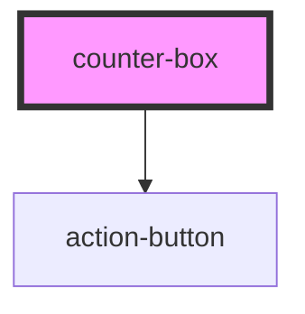

# counter-box

<!-- Auto Generated Below -->

## Properties

| Property | Attribute | Description | Type     | Default                   |
| -------- | --------- | ----------- | -------- | ------------------------- |
| `max`    | `max`     |             | `number` | `Number.MAX_SAFE_INTEGER` |
| `min`    | `min`     |             | `number` | `0`                       |
| `start`  | `start`   |             | `number` | `undefined`               |

## Dependencies

### Depends on

- [action-button](../action-button)

### Graph

----------------------------------------------

*Built with [StencilJS](https://stenciljs.com/)*
